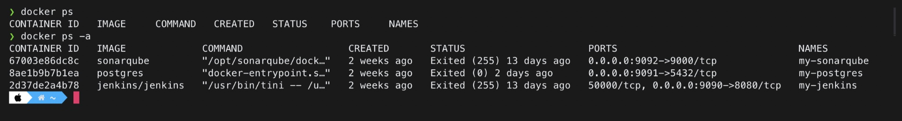
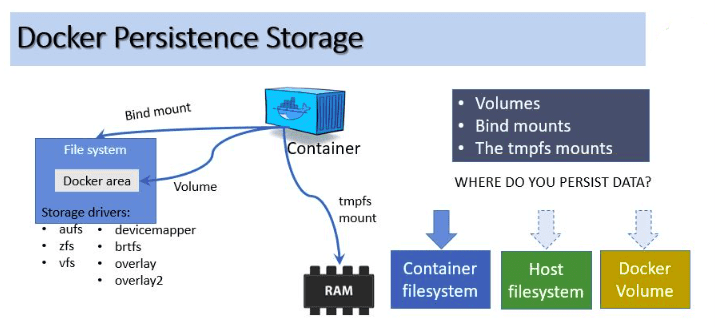

# The Docker Handbook

Learn Docker for Beginners

# Table of Contents

- **[Introduction](#introduction)**
  - **[What is Docker?](#what-is-docker)**
  - **[Docker Engine](#docker-engine)**
  - **[Docker Architecture](#docker-architecture)**
  - **[Docker Objects](#docker-objects)**
  - **[The underlying technology](#the-underlying-technology)**
- **[Installation](#installation)**
- **[Containers](#containers)**
  - **[Ports in Containers](#ports-in-containers)**
- **[Images](#images)**
  - **[Create Our Own Images](#create-our-own-images)**
- **[Volumes](#volumes)**
  - **[Choose the right type of mount](#choose-the-right-type-of-mount)**
    - **[Volumes](#volumes-1)**
    - **[Bind Mounts](#bind-mounts)**
    - **[tmpfs Mounts](#tmpfs-mounts)**
  - **[Good Use case for Volumes](#good-use-case-for-volumes)**

# Introduction

### What is Docker?

Docker is an open platform for developing, shipping, and running applications. Docker enables you to separate your applications from your infrastructure so you can deliver software quickly.

### Docker Engine

Docker Engine is a _client-server_ application with these major components:

- A server which is a type of long-running program called a daemon process (the dockerd command).

- A REST API which specifies interfaces that programs can use to talk to the daemon and instruct it what to do.

- A command line interface (CLI) client (the docker command).

<p align="center">
  
</p>

### Docker Architecture

As previously mentioned, Docker uses a **client-server** architecture.

- The **Docker client** talks to the **Docker daemon**, which does the heavy lifting of building, running, and distributing your Docker containers.
- The Docker client and daemon can run on the same system, or you can connect a Docker client to a remote Docker daemon.
- The Docker client and daemon communicate using a **REST API**, over UNIX sockets or a network interface.

<p align="center">
  
</p>

### Docker Objects

When you use Docker, you are creating and using **images**, **containers**, **networks**, **volumes**, **plugins**, and **other objects**. This section is a brief overview of some of those objects.

- **Image:**

  - An _image_ is a lightweight, stand-alone, executable package that includes everything needed to run a piece of software, including the code, a runtime, libraries, environment variables, and config files.

  - An image is a read-only template with instructions for creating a Docker container. Often, an image is based on another image, with some additional customization.

  - You might create your own images. To do that, you create a **Dockerfile** with a simple syntax for defining the steps needed to create the image and run it. Each instruction in a Dockerfile creates a layer in the image.

- **Container:**
  - A _container_ is a runtime instance of an image.
  - **Isolation:** It **runs completely isolated** from the host environment by default, only accessing host files and ports if configured to do so. By default, a container is relatively well isolated from other containers and its host machine. You can control how isolated a container’s network, storage, or other underlying subsystems are from other containers or from the host machine.
  - Containers **run apps natively** on the host machine’s kernel.
  - They have **better performance** characteristics than virtual machines that only get virtual access to host resources through a hypervisor.
  - Containers can get native access, each one running in a discrete process, taking no more memory than any other executable.

### The underlying technology

Docker is written in **Go** and takes advantage of several features of the Linux kernel to deliver its functionality.

- **Namespaces**

Docker uses a technology called **namespaces** to provide the isolated workspace called the container. When you run a container, Docker creates a set of namespaces for that container.

These namespaces provide a layer of isolation. Each aspect of a container runs in a separate namespace and its access is limited to that namespace.

**Docker Engine** uses namespaces such as the following on Linux:

- **The `pid` namespace:** Process isolation (PID: Process ID).
- **The `net` namespace:** Managing network interfaces (NET: Networking).
- **The `ipc` namespace:** Managing access to IPC resources (IPC: InterProcess Communication).
- **The `mnt` namespace:** Managing filesystem mount points (MNT: Mount).
- **The `uts` namespace:** Isolating kernel and version identifiers. (UTS: Unix Timesharing System).

- **Control Groups**

Docker Engine on Linux also relies on another technology called control groups (**cgroups**). A **cgroup** limits an application to a specific set of resources. Control groups allow Docker Engine to share available hardware resources to containers and optionally enforce limits and constraints. For example, you can limit the memory available to a specific container.

- **Union File Systems**

Union file systems, or **UnionFS**, are file systems that operate by **creating layers**, making them **very lightweight** and **fast**. Docker Engine uses UnionFS to provide the building blocks for containers. Docker Engine can use multiple UnionFS variants, including AUFS, btrfs, vfs, and DeviceMapper.

- **Container Format**

Docker Engine combines the namespaces, control groups, and UnionFS into a wrapper called a **container format**. The default container format is **libcontainer**. In the future, Docker may support other container formats by integrating with technologies such as BSD Jails or Solaris Zones.

# Installation

When we talk about "install docker" we are referring to installing "Docker Engine". To do this, we will do it by following the steps indicated in the [Official Documentation](https://docs.docker.com/engine/installation/).

# Containers

A container is a runnable instance of an image. You can create, start, stop, move, or delete a container using the Docker API or CLI. You can connect a container to one or more networks, attach storage to it, or even create a new image based on its current state.

### `ps`

ps – list containers

- View runing containers:

```shell
$ docker ps
```

- View "all history" of booted containers:

```shell
$ docker ps -a
```

- View the "ID" (-q) of the last (-l) container:

```shell
$ docker ps -l -q
```

<p align="center">
  
</p>

### `exec`

To access the shell of a "container" that we had previously started:

Indicating your ID:

```shell
$ sudo docker exec -i -t 67003e86dc8c /bin/bash
```

or but also through your name:

```shell
$ sudo docker exec -i -t my-sonarqube /bin/bash
```

### `run`

Create and start a container.
By default, a container starts, executes the command that we indicate and stops:

```shell
$ docker run busybox echo hello world
```

Por lo general `docker run` tiene la siguiente estructura:

```shell
$ docker run -p <host>:<container> username/repository:tag
```

We can pass various options to the `run` command, such as:

- `run` **interactivo**:

```shell
$ docker run -t -i ubuntu:16.04 /bin/bash
```

- **-h:** We configure a hostname for the "container".
- **-t:** Assign a TTY.
- **-i:** We communicate with the "container" interactively.

**Note:** Exiting interactive mode (-i) will stop the container.

- `run` **Detached Mode**:

As we already know, after running a container interactively, it ends. If you want to make containers that run services (for example, a web server) the command is the following:

   ```shell
   $ docker run -d -p 1234:1234 python:2.7 python -m SimpleHTTPServer 1234
   ```

- **Explanation:** This runs a **Python** server (SimpleHTTPServer module), on port **1234**.

  - **-p 1234:1234** tells Docker to _port forward_ the container to port 1234 on the host machine. Now we can open a browser at the address http://localhost:1234.

  - **-d:** makes the "container" run in the background. This allows us to execute commands on it at any time while it is running. For example:

  ```shell
  $ docker exec -ti <container-id> /bin/bash
  ```

  - Here a **tty** is simply opened in **interative** mode. Other things could be done like changing the _working directory_, setting environment variables, etc.

### `inspect`

Display details about a container:

- Info about a container:

```shell
$ dockerinspect
```

- Container IP address:

```shell
$ docker inspect --format '{{ .NetworkSettings.IPAddress }}' <container_name>
```

### `logs`

- Show logs about a container:

```shell
$ docker logs
```

### `stats`

- Container statistics (CPU, MEM, etc.):

```shell
$ docker stats
```

### Ports in Containers

- Public ports of the container:

```shell
$ docker port
```

- Publish port 80 of the container in a random port of the Host:

```shell
$ docker run -p 80 nginx
```

- Publish port 80 of the container in port 8080 of the Host:

```shell
$ docker run -p 8080:80 nginx
```

- Publish all the exposed ports of the container in random ports of the Host:

```shell
$ docker run -P nginx
```

- List all the mappings of the ports of a container:

```shell
$ docker port <container_name>
```

# Images

- See list of images:

```shell
$dockerimages
```

- View "all history" of ripped images:

```shell
$ dockerimages -a
```

- Delete an image:

```shell
$ docker rmi <images_name>
```

- To know the history and "layers" that an image has:

```shell
$ docker history <image_name>
```

### Create Our Own Images:

We can create our own images in different ways:

A) `docker commit`: build an image from a container.

Example:

```shell
  $ docker commit -m "Message we want" -a "Name of the person who did it" container-id NEW_NAME:TAG
  $ docker commit -m "MongoDB and Scrapy installed" -a "Etxahun" 79869875807 etxahun/scrapy_mongodb:0.1
```

B) `docker build`: create an image from a "Dockerfile" by executing the build steps given in the file.

Within a Dockerfile the "instructions" that we can use are the following:

- **FROM**: the base image for building the new docker image; provide "FROM scratch" if it is a base image itself.
- **MAINTAINER**: the author of the Dockerfile and the email.
- **RUN**: any OS command to build the image.
- **CMD**: specify the command to be stated when the container is running; can be overridden by the explicit argument when providing docker run command.
- **ADD**: copies files or directories from the host to the container in the given path.
- **EXPOSE**: exposes the specified port to the host machine.

Example:

```shell
$ nano myimage/Dockerfile

FROM ubuntu
RUN echo "my first image" > /tmp/first.txt

$ docker build -f myimage/Dockerfile || or else || docker build myimage
Sending build context to Doker daemon 2.048 KB
Step 1: FROM ubuntu
----> ac526a456ca4
Step 2: RUN echo "my first image" > /temp/first.txt
----> Running in 18f62f47d2c8
----> 777f9424d24d
Removing intermediate container 18f62f47d2c8
Successfully built 777f9424d24d

$dockerimages | grep 777f9424d24d

<none> <none> 777f9424d24d 4 minutes ago 125.2 MB

$ docker run -it 777f9424d24d
$ root@2dcd9d0caf6f:/#
```

We can put a name or "tag" the image at the time we are doing the "build":

```shell
$ docker build <dirname> -t "<imagename>:<tagname>"
```

Example:

```shell
$ docker build myimage -t "myfirstimage:latest"
```

### Tag the image

The notation commonly used to associate a local image with a "repository" within a "registry" is as follows: `username/repository:tag`. The "tag" part is optional, but recommended, since it is the way in which we will version the images in Docker.

To make the "tag" we will do the following:

```shell
$ docker tag image username/repository:tag
```

For example:

```shell
docker tag friendlyhello john/get-started:part2
```

To check the image we just tagged:

```shell
$ docker images_name

CONTAINER ID   IMAGE             COMMAND                  CREATED       STATUS                     PORTS                               NAMES
67003e86dc8c   sonarqube         "/opt/sonarqube/dock…"   2 weeks ago   Exited (255) 13 days ago   0.0.0.0:9092->9000/tcp              my-sonarqube
8ae1b9b7b1ea   postgres          "docker-entrypoint.s…"   2 weeks ago   Exited (0) 2 days ago      0.0.0.0:9091->5432/tcp              my-postgres
2d37de2a4b78   jenkins/jenkins   "/usr/bin/tini -- /u…"   2 weeks ago   Exited (255) 13 days ago   50000/tcp, 0.0.0.0:9090->8080/tcp   my-jenkins
```

### Publish the image

To publish the image we will do the following:

```shell
$ docker push username/repository:tagear
```

Once uploaded, we can see it on the [Docker Hub](https://hub.docker.com/ "Docker Hub") website.

# Volumes

**References:**

- [Docker Volumes Tutorial](http://containertutorials.com/volumes.html "Docker Volumes Tutorial")

It is possible to store data within the writable layer of a container, but there are some downsides:

- The data won't persist when that container is no longer running, and it can be difficult to get the data out of the container if another process needs it.

- A container's writable layer is tightly coupled to the host machine where the container is running. You can't easily move the data somewhere else.

- Writing into a container's writable layer requires a storage driver to manage the filesystem. The storage driver provides a union filesystem, using the Linux kernel. This extra abstraction reduces performance as compared to using data volumes, which write directly to the host filesystem.

Docker offers **three different ways to mount data** into a container from the Docker host:

-Volumes
-Bind mounts
-Tmpfs volumes

When in doubt, volumes are almost always the right choice.

### Choose the right type of mount

No matter which type of mount you choose to use, the data looks the same from within the container. It is exposed as either a directory or an individual file in the container's filesystem.

An easy way to visualize the difference between `volumes`, `bind mounts`, and `tmpfs mounts` is to think about where the data lives on the Docker host.

<p align="center">
   
</p>

- #### Volumes

  `Volumes` are stored in a part of the host filesystem which is managed by Docker (/var/lib/docker/volumes/ on Linux). Non-Docker processes should not modify this part of the filesystem. **Volumes are the best way to persist data in Docker**.

  `Volumes` are created and managed by Docker. You can create a volume explicitly using the `docker volume create` command, or Docker can create a volume during container or service creation.

  When you create a volume, it is **stored within a directory on the Docker host**. When you mount the volume into a container, this directory is what is mounted into the container. This is similar to the way that bind mounts work, except that volumes are managed by Docker and are isolated from the core functionality of the host machine.

  A given volume **can be mounted into multiple containers simultaneously**. When no running container is using a volume, the volume is still available to Docker and is not removed automatically. You can remove unused volumes using `docker volume prune`.

  When you mount a volume, it may be **named** or **anonymous**. Anonymous volumes are not given an explicit name when they are first mounted into a container, so Docker gives them a random name that is guaranteed to be unique within a given Docker host.

- #### Bind mounts

  `Bind mounts` may be stored anywhere on the host system. They may even be important system files or directories. Non-Docker processes on the Docker host or a Docker container can modify them at any time.

  `Bind mounts` have limited functionality compared to `volumes`. When you use a `bind mount`, a file or directory on the host machine is mounted into a container. The file or directory is **referenced by its full path** on the host machine.

  The file or directory does not need to exist on the Docker host already. It is created on demand if it does not yet exist. Bind mounts are very performant, but they rely on the host machine's filesystem having a specific directory structure available.

  If you are developing new Docker applications, consider using named `volumes`.

  **Warning:** One side effect of using bind mounts, for better or for worse, is that you can change the host filesystem via processes running in a container, including creating, modifying, or deleting important system files or directories. This is a powerful ability which can have security implications, including impacting non-Docker processes on the host system.

- #### tmpfs mounts

  `tmpfs mounts` are stored in the host system's memory only, and are never written to the host system's filesystem.

  A `tmpfs mount` is **not persisted on disk**, either on the Docker host or within a container. It can be used by a container during the lifetime of the container, to store non-persistent state or sensitive information. For instance, internally, swarm services use tmpfs mounts to mount secrets into a service's containers.

### Good use cases for Volumes

**Volumes are the preferred way to persist data** in Docker containers and services. Some use cases for volumes include:

- Sharing data among multiple running containers. If you don't explicitly create it, a volume is created the first time it is mounted into a container. When that container stops or is removed, the **volume still
